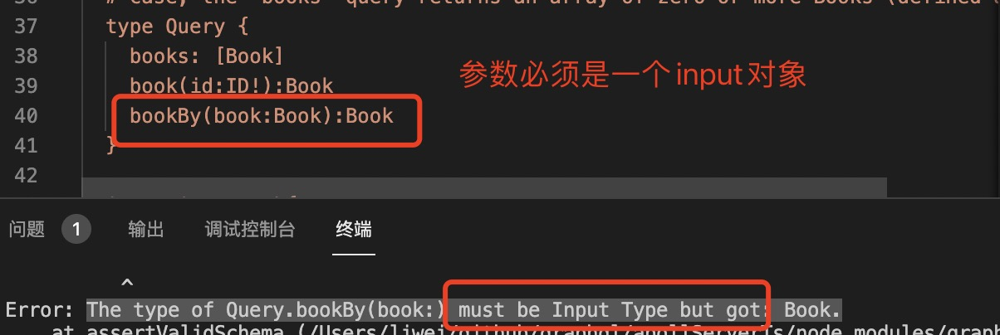
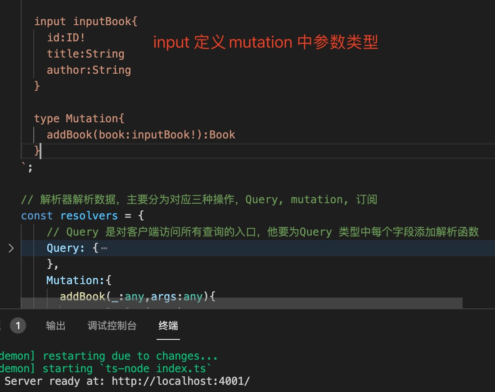

1. 标量类型（graphql内置类型)

+ Int: 整型，32位

+ Float: 浮点型

+ String：字符串，utf-8

+ Boolean: 布尔类型，只有true 和 false

+ ID: 唯一标识符，不能有重复值，序列化为字符串。

2. Object 类型

   > 包含三种特殊的***根操作***类型 Query, Mutation 和 Subscription 类型

   + Query 类型： Query 类型中所有字段对与客户端来说用于查询数据，相当于rest 中的查询接口

       ***它定义了客户端针对您的服务器执行的查询Query的所有顶级入口点。***

   + Mutaion 类型：用于数据的修改

      同Query 类型一致，Query类型定义了读操作的入口点，而类型Mutation定义了写操作的入口点。

   + Subscription: 订阅

3. Input: 输入类型，用于Query 和 Mutation 中参数

    

    

4. Enum: 枚举类型

5. Union: 联合类型

6. interface: 接口

7. 自定义类型

        type user{
            id:ID!
            name:String
        }

        type userBook{
            id:ID!
            name:String
            user:user // 自定义类型
        }

8. 数组类型 []

9. __typename: 每个对象类型都会自动有一个名为__typename 的字段。

    该__typename 字段将对象类型的名称作为String 类型返回

2. !(感叹号) 表示不能为null

   用于数组时

   + 在数组外面，表示数组不能为null

            books:[book]!  表示books 不能为null
    
    + 在数组里面时，表示数组中不能有null 的元素

            books:[book!] 表示数组中不能有null 的元素，比如:[1,null,2] // 这是错误的

3. 