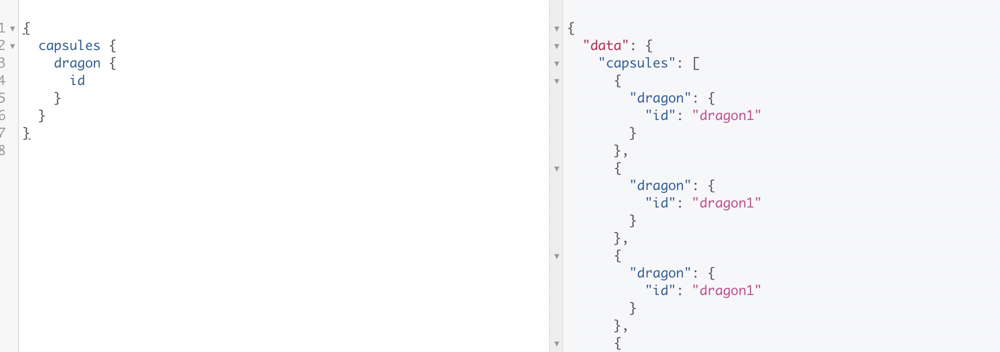
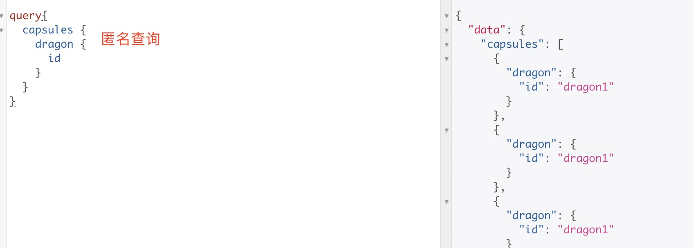
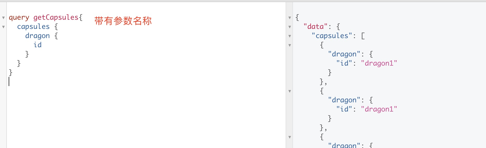

1. 操作名称

  * 操作类型：可以是query、mutation 、 subscription

  * 操作名称： 这个不是必须的，是你的操作的有意义和明确的名称。它仅在有多个操作的文档中是必需的，
  ***但我们鼓励使用它，因为它对于调试和服务器端日志记录非常有用。*** 当在你的网络或是 GraphQL 服务器的日志中出现问题时，通过名称来从你的代码库中找到一个查询比尝试去破译内容更加容易。 就把它想成你喜欢的程序语言中的函数名。例如，在 JavaScript 中，我们只用匿名函数就可以工作，***但是当我们给了函数名之后，就更加容易追踪、调试我们的代码，并在其被调用的时候做日志。***同理，GraphQL 的查询和变更名称，以及片段名称，都可以成为服务端侧用来识别不同 GraphQL 请求的有效调试工具

   > 操作名称不影响查询结果，

   
   
   