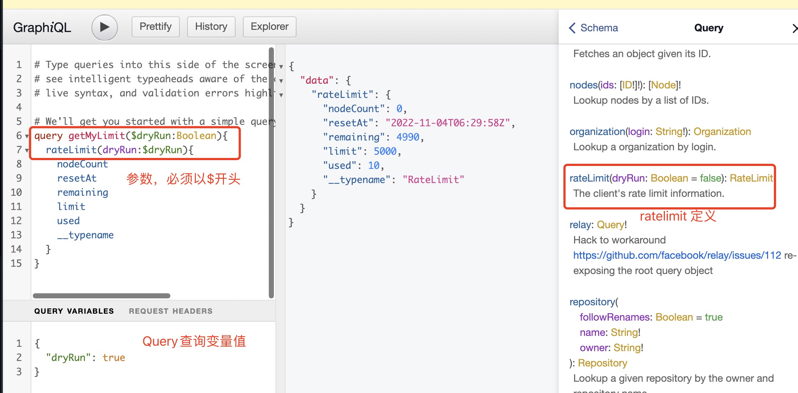
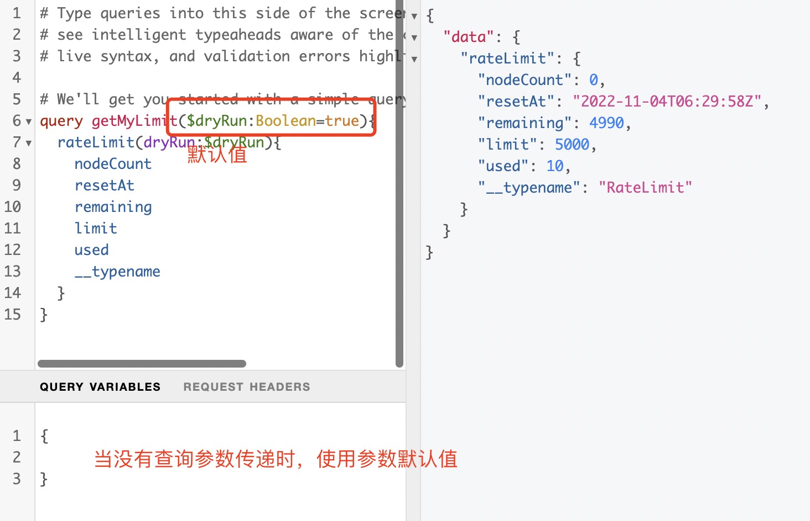
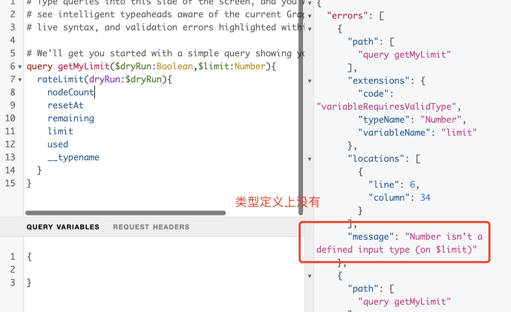

1. 变量使用美元符号开始$

        query HeroNameAndFriends($episode: Episode) {
            hero(episode: $episode) {}
        }
    
    > 变量前缀必须为 $开头

    

    变量定义可以是可选的或者必要的。上例中，Episode 后并没有 !，因此其是可选的。***但是如果你传递变量的字段要求非空参数，那变量一定是必要的***

2. 变量默认值

    变量参数可以提供默认值，当没有传递参数的值时使用默认值

        query HeroNameAndFriends($episode: Episode = "JEDI") {
            hero(episode: $episode) {
              name
              friends {
                name
              }
            }
        }

    

  3. graphql 不接受额外的参数

     