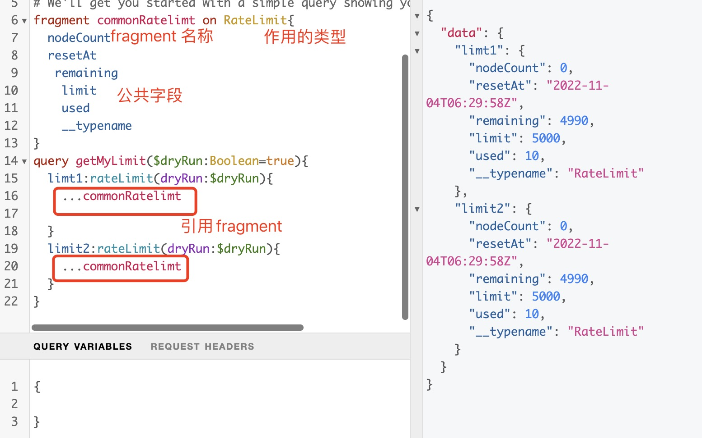

1. Fragments 

    graphql 在复杂查询的时候，比如过个查询过程中，肯能有很多重复的字段，我们不得不在每个查询下面一一列举，比如下面的查询：

    

    上面两个查询中字段完全相同，怎样解决这种重复的字段？

    > Fragments:片段允许我们“分解”查询的公共字段 

    

    > fragment 语法

         fragment  FragmentName  on  Type{
             field 字段
         }

         FragmentName: 片段的名称

         Type: 作用与那个定义的类型

         field: 公共字段