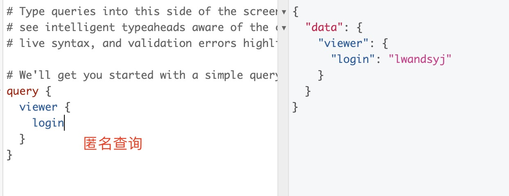
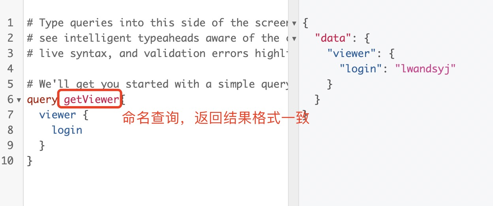

1. 强烈建议为您的查询命名。尽管***名称是可选的***，但它对代码生成器和客户端很重要。大多数客户端使用该名称进行缓存。而且查询名称对服务器端追踪也很有用。

   apollo client 和 typescript 类型生成等工具也使用命名查询，因此虽然名称在技术上是可选的，但使用他们是个好主意

   查询时可以匿名查询：

   

   > 命名查询并不影响返回的结果

   