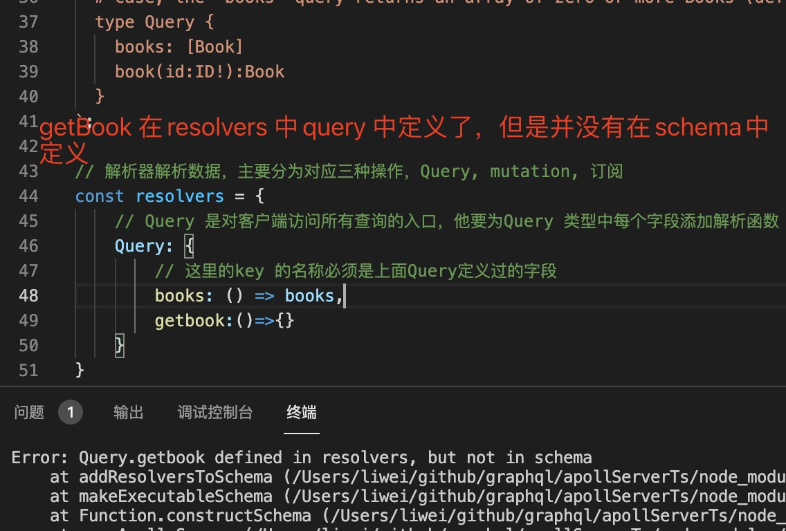

1. resolve 是为Query 类型或者Mutation 类型中的每个字段提供解析函数

   解析器是一个函数，负责为架构中的单个字段填充数据

   **它可以以您定义的任何方式填充该数据，例如通过从后端数据库或第三方 API 获取数据。**

   resolve 函数中每一个字段都必须和Query 类型或者Mutation 中定义的类型一致，不然后会报

   

2. 解析程序可以是异步的，并且可以从RESTAPI、数据库或者另一个graphql 服务或任何其他服务获取或更新数据。

3. 解析器函数参数

   每一个解析器都包含四个参数

   + parent: 此字段父级的解析器的返回值（即，解析器链中的前一个解析器）。

        对于没有父级的顶级字段（例如 的字段Query）的解析器，此值是从rootValue传递给Apollo Server 的构造函数的函数中获取的
    
    + args: 包含为此字段提供的所有 GraphQL 参数的对象。

        例如，在执行时query{ user(id: "4") }，args传递给user解析器的对象是{ "id": "4" }.
    

    + context: 为特定操作执行的所有解析器共享的对象。使用它来共享每个操作的状态，包括身份验证信息、数据加载器实例以及要跨解析器跟踪的任何其他内容

    
    + info: 包含有关操作执行状态的信息，包括字段名称、从根到字段的路径等。