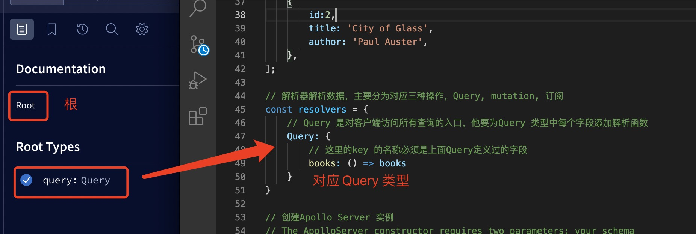
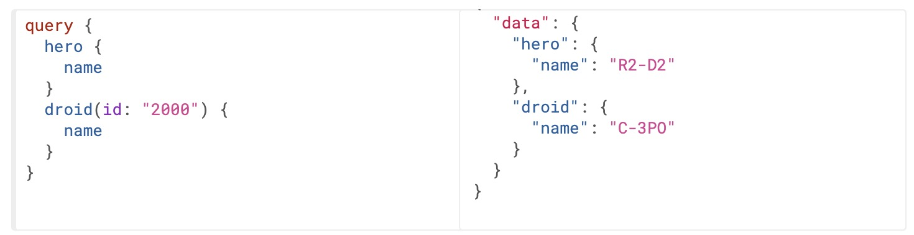
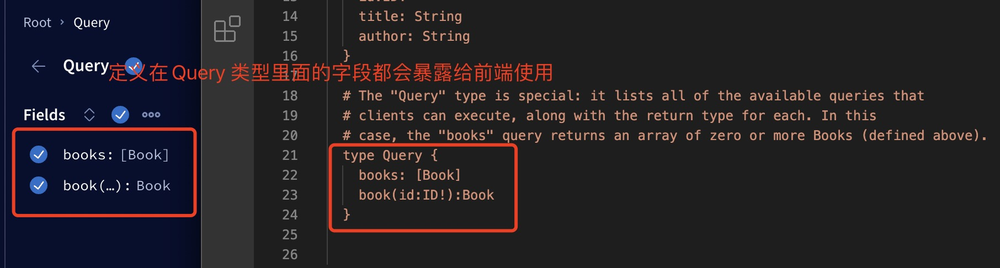
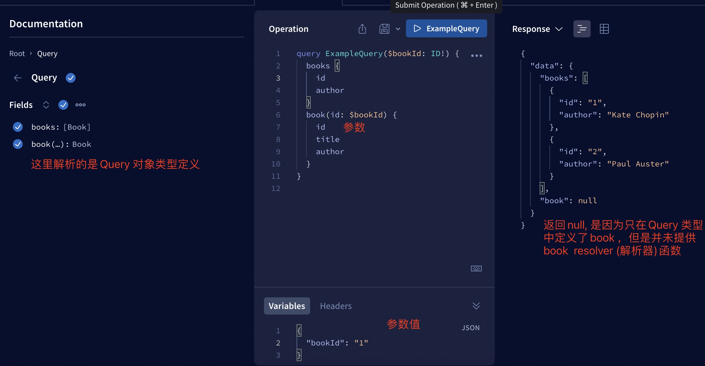
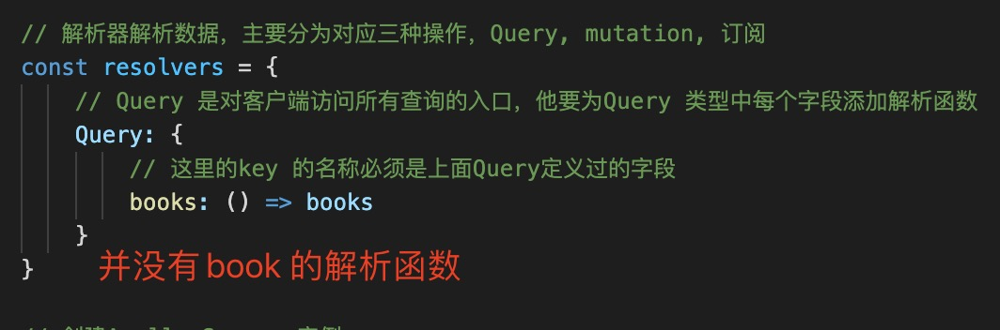
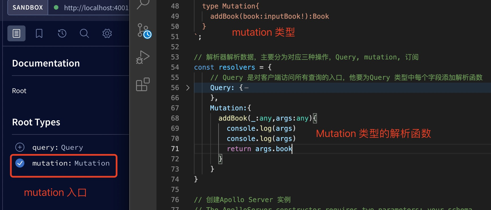
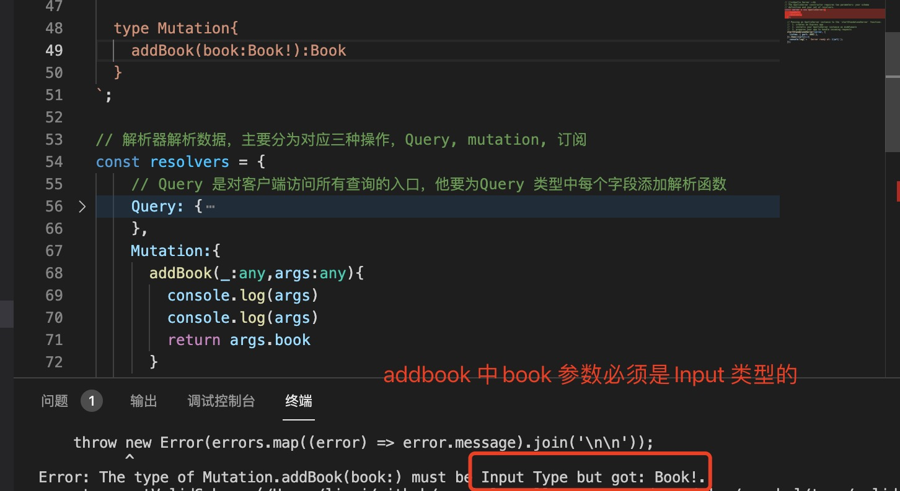
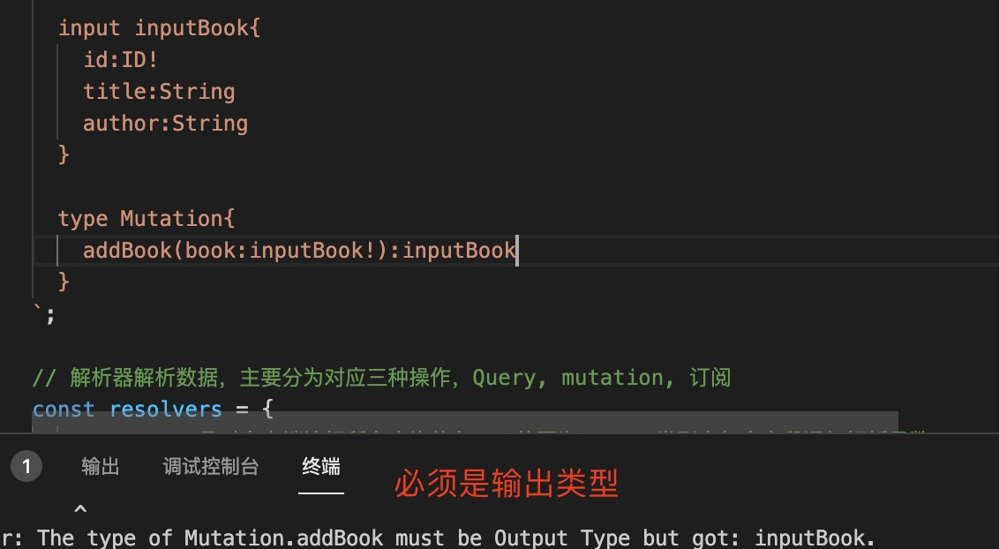

1. graphql 入口只有一个，包括Query 或者 Mutation

    

2. 每个 GraphQL 服务都有一个query类型，可能有也可能没有mutation类型

    这些类型与常规对象类型相同，***但它们是特殊的，因为它们定义了每个 GraphQL 查询的入口点,它定义了客户端可以再我们的模式中查询的数据***

    

    因为query 类型是graphql 搜友查询的入口点，以上图为例，这意味着 GraphQL 服务需要有一个Query带有hero和droid字段的类型：

        type Query {
            hero(episode: Episode): Character
            droid(id: ID!): Droid
        }

    > Query 类型定义了graphql 对外暴露的接口查询的搜友字段，

    

    每一个字段要想获得数据，就必须为Query 对象中每一个字段提供的一个解析函数
    

    

    > 如果字段参数为一个对象，则必须为Input 类型

      The type of Query.bookBy(book:) must be Input Type but got: Book.

      

3. mutation ： 同Query 类型一样，不同的是mutation 定义了所有更改，删除，上传等类型接口的定义

    

    > Mutation 字段中参数，不能是type 类型定义的，要使用input(可输入的类型)

      The type of Mutation.addBook(book:) must be Input Type but got: Book!.

      

      解决方案：参数book换成input 类型

      
    
    > Mutation 中字端返回值不能为input(可输入类型)

      The type of Mutation.addBook must be Output Type but got: inputBook.

      

      解决方案：返回值换回type 定义的类型